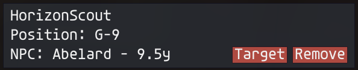
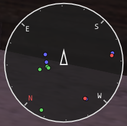
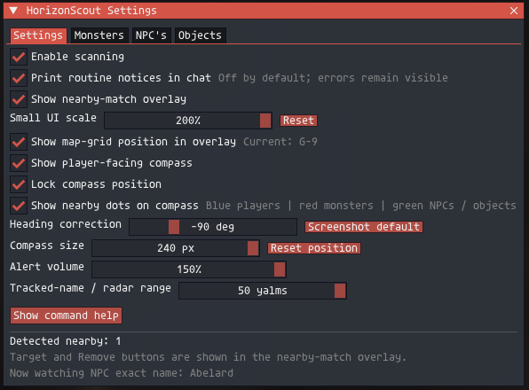
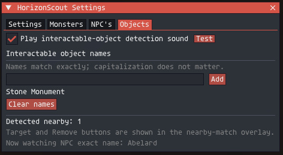

# HorizonScout

HorizonScout is an Ashita v4 addon for finding nearby monsters, NPCs, and
interactable objects in Final Fantasy XI.

It provides:

- Exact-name alerts with separate custom sounds for monsters, NPCs, and objects.
- A small nearby-results panel with `Target` and `Remove` buttons.
- Your current map-grid position, such as `H-9`.
- A compass radar with blue player dots, red monster dots, and green NPC/object
  dots.
- Optional warnings when a nearby monster is marked aggressive by MobDB.

HorizonScout only observes nearby rendered entities. It does not move your
character, interact with targets, send gameplay commands, or search an entire
zone.

> HorizonScout is a custom addon. Check the current HorizonXI addon rules before
> using it on the live server.

## Preview

Real in-game screenshots showing the nearby tracker, compass radar, and settings.
These show an example configuration, not the default values listed below.

<table>
  <tr>
    <th>Nearby tracker</th>
    <th>Compass radar</th>
  </tr>
  <tr>
    <td valign="top"></td>
    <td valign="top"></td>
  </tr>
</table>

Blue dots are players, red dots are monsters, and green dots are NPCs or objects.
`Target` selects a detected entity without interacting with it.

<details>
<summary>View the four settings tabs</summary>

### Settings

Shared scanning, display, compass, volume, and tracking-range controls.



### Monsters

Tracked-monster sound, aggressive warning range and cooldown, chocobo suppression,
and level filtering. The database status here shows `Ready: MobDB`.


### NPC's

Exact-name NPC tracking and its separate sound control.


### Objects

Exact-name object tracking and its separate sound control.



</details>

## Requirements

- Final Fantasy XI running through Ashita v4.
- MobDB or XIUI's included MobDB data for aggressive-monster warnings.

Normal name tracking, the compass, map position, and radar do not require MobDB.

## Installation

1. Download `HorizonScout-v0.12.1.zip` from the
   [GitHub Releases page](https://github.com/ryuutatsuo23-max/HorizonScout/releases/latest).
2. Extract the ZIP. It contains one folder named `HorizonScout`.
3. Copy that folder to your Ashita addons directory. A typical HorizonXI path is:

   ```text
   C:\Games\HorizonXI\Game\addons\HorizonScout
   ```

4. In game, load the addon:

   ```text
   /addon load HorizonScout
   ```

5. Open the settings window:

   ```text
   /horizonscout
   ```

After updating an existing installation, use:

```text
/addon reload HorizonScout
```

## Everyday use

The settings window has four tabs:

### Settings

- Enable or pause scanning.
- Show, resize, or hide the small results panel.
- Show your map-grid position.
- Show, move, lock, resize, or hide the compass radar.
- Adjust the shared alert volume from 0% to 150%.
- Adjust the normal tracked-name and radar range.

### Monsters

- Add exact monster names to track.
- Enable or test `mobalert.wav`.
- Enable or test aggressive-monster warnings.
- Adjust the aggressive warning range and sound cooldown.
- Suppress aggressive warnings while riding a chocobo.
- Ignore aggressive monsters far below your current main-job level.

### NPC's

- Add exact NPC names to track.
- Enable or test `npcalert.wav`.

### Objects

- Add exact names for doors, monuments, `???` targets, and other interactable
  objects.
- Enable or test `interactablealert.wav`.

Names match exactly, but capitalization does not matter. For example, `Sand Bat`
will also match `sand bat`.

When a tracked result is nearby, the small panel offers:

- `Target`: selects the entity without interacting with it.
- `Remove`: stops watching that exact name.

## Default settings

| Setting | Default |
| --- | ---: |
| Tracked-name and radar range | 50 yalms |
| Aggressive warning range | 18 yalms |
| Aggressive sound cooldown | 10 seconds |
| Ignore aggressive monsters below your level | 15 levels |
| Chocobo suppression | On |
| Alert volume | 100% |
| Small results-panel scale | 100% |
| Compass size | 112 px |

The aggressive cooldown prevents a second aggressive monster, or rapid movement
in and out of range, from restarting the WAV. Set it to `0` to disable the
cooldown. Detection and the nearby count continue normally during the cooldown.

## Useful commands

`/hs` is the short alias for `/horizonscout`. The older `/mobalert` name is also
accepted. HorizonScout deliberately does not use `/ma`, because `/ma` is FFXI's
magic command.

```text
/horizonscout                         Open or close settings
/horizonscout add <monster name>      Add a monster name
/horizonscout remove <monster name>   Remove a monster name
/horizonscout addnpc <NPC name>       Add an NPC name
/horizonscout removenpc <NPC name>    Remove an NPC name
/horizonscout addobject <name>        Add an object name
/horizonscout removeobject <name>     Remove an object name
/horizonscout on|off                  Resume or pause scanning
/horizonscout show|hide               Show or hide the results panel
/horizonscout compass on|off          Show or hide the compass
/horizonscout range <1-50>            Set tracked-name/radar range
/horizonscout aggrorange <1-50>       Set aggressive warning range
/horizonscout aggrocooldown <0-60>    Set aggressive sound cooldown
/horizonscout sound on|off|test       Monster alert sound
/horizonscout npcsound on|off|test    NPC alert sound
/horizonscout objectsound on|off|test Object alert sound
/horizonscout aggrosound on|off|test  Aggressive warning sound
/horizonscout help                    Show all commands in settings
```

## Custom sound files

HorizonScout includes these sounds:

- `mobalert.wav` for tracked monsters.
- `npcalert.wav` for tracked NPCs.
- `interactablealert.wav` for tracked objects.
- `aggressivealert.wav` for aggressive-monster warnings.

You can replace a sound by keeping the same filename. For best compatibility
with the volume control, use an uncompressed PCM WAV: mono, 16-bit, 48 kHz.

## Aggressive-monster warning

This feature reads local MobDB data. HorizonScout prefers the exact spawn-index
record, then falls back to the monster name when no spawn record exists.

By default, a monster is ignored when its maximum MobDB level is at least 15
levels below your current synchronized main-job level. Monsters with missing or
zero level data still warn so that uncertain data does not silently hide a
possible threat.

The warning is a nearby safety reminder, not a guarantee that a monster will
aggro. MobDB cannot account for walls, facing direction, Sneak, Invisible,
time/weather rules, or special conditions such as low-HP blood aggro.

## Troubleshooting

### The settings window does not open

Use `/horizonscout` or `/hs`. Then try reloading the addon:

```text
/addon reload HorizonScout
```

### A normal name alert does not appear

- Confirm the name was added to the correct tab.
- Confirm the spelling matches the in-game name exactly.
- The entity must be rendered and within the configured range.

### Aggressive warnings do not work

- Open the Monsters tab and check the database status.
- It should show `Ready: MobDB` or `Ready: XIUI MobDB`.
- Confirm the warning sound is enabled.
- Check the chocobo, level-gap, range, and cooldown settings.

### A sound does not play

- Check that alert volume is above 0%.
- Use the category's `Test` button.
- Confirm the matching WAV file is present in the HorizonScout folder.

## License

HorizonScout is released under the [MIT License](LICENSE).
